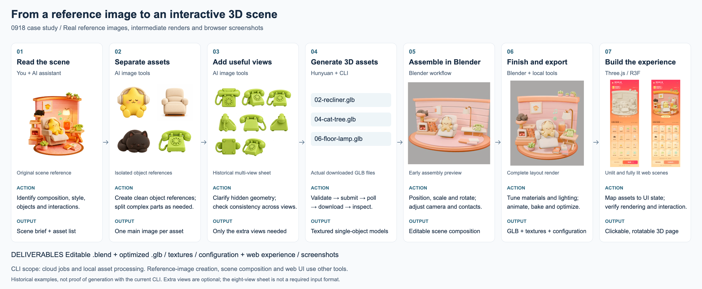

# Image-to-scene workflow

[English](workflow.md) | [简体中文](workflow.zh-CN.md) · [README](../README.md)

Click the image for the full-size horizontal diagram. An editable [SVG version](assets/workflow-en.svg) is also included.

## What happens at each stage

| Stage | Work performed | Output | Tool ownership |
| --- | --- | --- | --- |
| 1. Read the scene | Identify composition, style, assets, occlusion and intended interactions | Scene brief and asset list | User and AI assistant |
| 2. Separate assets | Create clean single-object references; split complex objects into useful parts | One main reference per asset | Image-generation tools, outside this CLI |
| 3. Add useful views | Clarify hidden geometry and check consistency | Supplementary views where necessary | Image-generation tools, outside this CLI |
| 4. Generate 3D assets | Validate requests, submit jobs, poll, download and inspect | Textured single-object GLBs | Tencent Cloud AI3D and this CLI |
| 5. Assemble the scene | Adjust transforms, camera, contact and occlusion; add background geometry | Editable Blender scene | Blender scene workflow, outside this CLI |
| 6. Finish and export | Author materials, lighting and animation; bake and optimize resources | `.blend`, GLB, textures and asset configuration | Blender plus local asset tools; the CLI covers normalization and optimization |
| 7. Build the experience | Load models, connect state and interaction, verify in the browser | Interactive page and screenshots | Three.js / R3F application, outside this CLI |

The CLI does **not** turn a complete reference scene into a finished interactive website in one command. It handles the cloud-job and local-asset portions of a wider workflow.

## Reading the example

These are historical assets from the 0918 scene: original scene reference, isolated object references, a telephone multi-view sheet, downloaded model filenames, early Blender assembly, complete layout rendering, and two actual browser states. They illustrate the process, not a benchmark or evidence that the current CLI version generated those old models.

Use the strongest primary image and add only helpful views. The historical eight-view sheet is a preparation example, not a required upload format or a promise that all eight views are accepted by an API. Submit supported individual views using the [SDK request schema](sdk-requests.md). Hidden geometry in generated reference images is inferred and needs review.

The browser example includes object activation through clicks or dragging, collectible count changes, scene rotation, and animation. These behaviors belong to that application; they are not bundled UI features of the npm package.

## Deliverables and review

| Deliverable | Example | Purpose |
| --- | --- | --- |
| Editable source | `0918-animated.blend` | Continue scene and animation work |
| Runtime model | `room-optimized.glb` | Load in the target renderer |
| Supporting resources | Lightmaps, textures, `scene-config.json` | Preserve appearance and map object behavior |
| Runtime evidence | Unlit / fully lit browser screenshots | Verify the actual application result |

Review references before generation, geometry after download, composition in Blender, and rendering in the target application. A mismatch returns to the relevant stage; a new paid generation requires an explicit spending decision. `hunyuan3d generate` requires `--confirm-spend` for cloud submission.

Only the diagrams and documentation are included here. The large scene sources, models and application are not bundled into the CLI repository or npm package by this documentation change.
