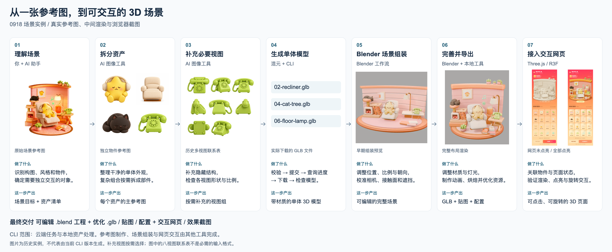

# 从参考图到交互场景

[English](workflow.md) | [简体中文](workflow.zh-CN.md) · [项目说明](../README.zh-CN.md)

点击图片查看完整横向大图。也提供可编辑的 [SVG 版本](assets/workflow-zh-cn.svg)。

## 每一步做了什么

| 阶段 | 具体工作 | 产出 | 由谁完成 |
| --- | --- | --- | --- |
| 1. 理解场景 | 分析构图、风格、物件、遮挡与预期交互 | 场景目标和资产清单 | 用户与 AI 助手 |
| 2. 拆分资产 | 制作干净的单体参考，复杂组合按需拆件 | 每个资产的主参考图 | 图像生成工具，不属于 CLI |
| 3. 补充视图 | 交代隐藏结构，检查多视图一致性 | 必要的补充视图 | 图像生成工具，不属于 CLI |
| 4. 生成模型 | 校验请求、提交、轮询、下载并检查 | 带材质的单体 GLB | 腾讯云 AI3D 与本 CLI |
| 5. 场景组装 | 调整变换、相机、接触面与遮挡，补背景几何 | 可编辑的 Blender 场景 | Blender 场景工作流，不属于 CLI |
| 6. 完善与导出 | 制作材质、灯光和动画，烘焙与优化资源 | `.blend`、GLB、贴图和资产配置 | Blender 与本地处理工具；CLI 提供规范化和优化环节 |
| 7. 接入网页 | 加载模型，关联状态与交互，在浏览器验收 | 可交互页面和效果截图 | Three.js / R3F 应用，不属于 CLI |

这个 CLI **不是一条命令将完整参考图变成交互网站**的工具。它负责完整工作流中的云端任务和本地资产处理部分。

## 如何理解示例

这里使用的是 0918 场景的历史素材：原始场景图、独立物件参考图、电话多视图、下载后的模型文件名、早期 Blender 组装、完整布局渲染，以及两种真实浏览器状态。这些图片用于说明流程，不是性能基准，也不代表这些旧模型由当前 CLI 版本生成。

选择最清楚的主图，只补充真正有帮助的视角。历史八视图联系表是参考图准备示例，不是必需的上传格式，也不意味着 API 接受全部八个视角。提交时应按 [SDK 请求格式](sdk-requests.md) 选择支持的独立视图。原图不可见的结构属于推断，需要检查。

网页示例包含点击或拖入点亮、收集数量变化、场景旋转和动画。这些是示例应用的功能，不是 npm 包自带的 UI。

## 交付物与检查

| 交付物 | 示例 | 用途 |
| --- | --- | --- |
| 可编辑源文件 | `0918-animated.blend` | 继续修改场景与动画 |
| 运行时模型 | `room-optimized.glb` | 在目标渲染器中加载 |
| 配套资源 | 明暗贴图、纹理、`scene-config.json` | 保持外观并映射物件行为 |
| 运行效果证据 | 未点亮 / 全部点亮浏览器截图 | 检查真实应用结果 |

生成前检查参考图，下载后检查几何，在 Blender 检查构图，再在目标应用验收渲染。发现偏差时返回对应阶段修改；新的付费生成需要明确决定是否支出。`hunyuan3d generate` 在云端提交时要求 `--confirm-spend`。

本次仅收录流程图和文档，不将大型场景工程、模型和示例应用打包进 CLI 仓库或 npm 包。
